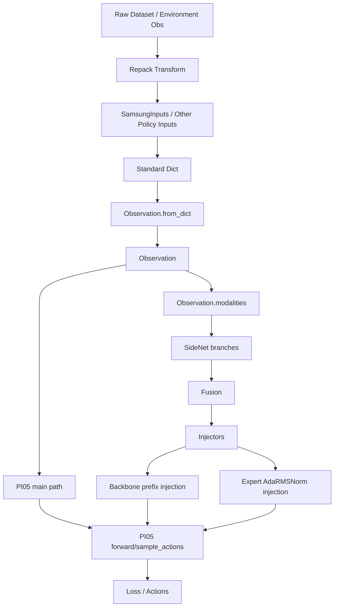

# SideNet Integration README

## 1. Scope

This directory contains the SideNet integration for `PI05` in the local `openpi` fork.

The current state is:

- `SideNet` supports multiple branches from YAML.
- `PI05withSideNet` supports both training-time and inference-time injection.
- training has been pulled back onto the standard `(Observation, actions)` interface.
- inference has been integrated into the existing `policy_config.py -> Policy -> serve_policy.py` path.
- checkpoints are split into base model / full SideNet / per-branch / shared-parts artifacts.

This README documents:

- architecture
- data contract
- training and inference entrypoints
- config responsibilities
- checkpoint layout
- smoke-test coverage
- known limitations

---

## 2. High-Level Architecture



Short version:

- standard model inputs still live in `Observation.images`, `Observation.image_masks`, `Observation.state`, prompt fields
- SideNet-specific inputs now live in `Observation.modalities`
- `PI05withSideNet` reads `Observation.modalities` by default
- policy inference and training no longer need a separate external `modality_input_dict` in the common path

---

## 3. Main Files and Responsibilities

### `sidenet/`

- `sidenet.py`
  - multi-branch SideNet
  - internal learnable modality gates
  - fusion + injectors
- `parse_config.py`
  - parses the YAML into typed config objects
- `pi05side.py`
  - `PI05withSideNet`
  - integrates SideNet into `PI05` training and inference
- `train.py`
  - PyTorch training entrypoint for SideNet experiments
  - split checkpoint save/load
- `ft_window_dataset.py`
  - `FTWindowDatasetWrapper`
  - dataset-side temporal F/T window construction for training
  - emits `observation.ft_sensor_window`
- `sidenet_config.yaml`
  - default / intended SideNet architecture
- `sidenet_smoke_config.yaml`
  - local smoke-only SideNet architecture
  - used to keep CPU smoke tests lightweight and shape-compatible

### `src/openpi/...`

- `src/openpi/models/model.py`
  - `Observation`
  - now includes `modalities`
- `src/openpi/policies/samsung_policy.py`
  - Samsung-specific inference/training input contract
  - maps `observation.ft_sensor -> force_torque`
  - includes `SamsungFTWindowInputs` for inference-time F/T history
- `src/openpi/training/config.py`
  - `SideNetTrainConfig`
  - `SideNetCheckpointConfig`
  - `SamsungDataConfig`
  - `pi05_with_sidenet`
  - smoke configs
- `src/openpi/training/data_loader.py`
  - wraps LeRobot datasets with `FTWindowDatasetWrapper` when `ft_window_size` is configured
- `src/openpi/policies/policy_config.py`
  - loads split SideNet checkpoints for inference
  - swaps Samsung inference onto `SamsungFTWindowInputs` when `ft_window_size` is configured
- `src/openpi/policies/policy.py`
  - unchanged inference call path
  - now works because extra modalities survive in `Observation.modalities`
- `scripts/serve_policy.py`
  - existing websocket server CLI
  - now works with SideNet through `policy_config.py`

---

## 4. Standardized Data Contract

### 4.1 Before

Previously, SideNet training bypassed the standard loader contract:

- training script read `loader._data_loader`
- raw batch was manually split into:
  - `Observation`
  - `actions`
  - `modality_input_dict`

This was a temporary workaround and was not aligned with the rest of `openpi`.

### 4.2 Now

Side modalities are stored inside:

```python
Observation.modalities: dict[str, Tensor] | None
```

This means:

- standard training still sees `(Observation, actions)`
- policy inference still passes a single `Observation`
- `PI05withSideNet` pulls SideNet inputs from `Observation.modalities`

### 4.3 Meaning of `config.sidenet.modalities`

`config.sidenet.modalities` now refers to:

- keys inside `Observation.modalities`
- which should also match SideNet branch names

Example:

```python
modalities=("force_torque",)
```

This is intentionally **not** a raw dataset key anymore.

### 4.4 Samsung path

Current Samsung path is:

1. raw dataset contains:
   - `observation.images.cam_high_left`
   - `observation.images.cam_high_right`
   - `observation.images.cam_left_wrist`
   - `observation.images.cam_right_wrist`
   - `observation.state`
   - `observation.ft_sensor`
   - `action`
2. `SamsungDataConfig.repack_transforms` keeps these keys
3. if `ft_window_size=k` is configured for training, `data_loader.create_torch_dataset()` wraps the
   LeRobot dataset with `FTWindowDatasetWrapper` and materializes:
   - `observation.ft_sensor_window: [k, 12]`
4. `SamsungInputs` expects the same dot-delimited raw keys and maps:
   - images into standard `image` / `image_mask`
   - `observation.ft_sensor -> force_torque`
   - if present, `observation.ft_sensor_window -> force_torque`
5. `Observation.from_dict()` collects non-standard fields into:
   - `Observation.modalities["force_torque"]`

There is no slash-delimited Samsung raw-key variant in the current code path.

So the standardized SideNet key for Samsung F/T is:

```python
force_torque
```

If you want `k`-frame F/T in training, set:

```python
SamsungDataConfig(..., ft_window_size=k)
```

Inference now supports the same temporal F/T contract through a Samsung-specific
stateful input transform. When `ft_window_size=k` is configured for Samsung
policy loading:

- the policy keeps a local F/T history deque of length `k`
- `frame_index == 0` resets that history
- a frame-index rewind also resets that history
- if the caller already provides `observation.ft_sensor_window`, that explicit
  window takes precedence

Inference does not rely on an episode id for this path.

---

## 5. SideNet YAML Responsibilities

### `sidenet/sidenet_config.yaml`

This is the main SideNet architecture config.

It defines:

- `branches`
- each branch’s:
  - encoder
  - projector
  - refiner
- shared `fusion`
- injectors:
  - `backbone`
  - `expert`

This YAML determines what modules are instantiated.

Important consequence:

- if a branch is removed from this YAML and the model is rebuilt, that branch will not be instantiated and will not occupy parameter memory

### `sidenet/sidenet_smoke_config.yaml`

This is smoke-only.

It exists because:

- the local CPU smoke model uses a reduced `smoke_action_expert`
- therefore the `expert` injector width must also be reduced

Do not use the smoke YAML as your production training YAML unless you explicitly want that smaller architecture.

---

## 6. Training Config Responsibilities

### `TrainConfig`

This is still the top-level runtime object.

Relevant fields:

- `name`
- `exp_name`
- `model`
- `data`
- `pytorch_weight_path`
- `checkpoint_base_dir`
- `assets_base_dir`
- `sidenet`

### `SideNetTrainConfig`

This controls SideNet behavior.

Key fields:

- `enabled`
  - whether to use `PI05withSideNet`
- `config_path`
  - path to SideNet YAML
- `train_pi05`
  - `False`: train SideNet only
  - `True`: train PI05 + SideNet
- `modalities`
  - selected keys from `Observation.modalities`
- `use_backbone_injector`
- `use_expert_injector`
- `trainable_branches`
  - if empty: all branches trainable
  - if non-empty: only listed branches trainable

### `SideNetCheckpointConfig`

This controls save/load behavior.

Key fields:

- `save_base_pi05`
- `save_sidenet_full`
- `save_sidenet_branches`
- `save_shared_parts`
- `sidenet_checkpoint_dir`
- `load_sidenet_full_path`
- `load_sidenet_branch_paths`
- `load_shared_parts_separately`
- `shared_parts_path`
- `strict_sidenet_load`

### Shared parts mean

`shared_parts.safetensors` currently includes:

- `fusion.*`
- `injectors.*`
- `modality_gates.*`
- `fusion_vectors`

Also note:

- gates are always trainable
- gates are treated as shared parameters, not branch-local training switches

---

## 7. Checkpoint Layout

The split checkpoint layout under one training step is:

```text
<checkpoint_dir>/<step>/
  metadata.pt
  optimizer.pt

  base_pi05.safetensors          # optional
  sidenet.safetensors            # optional
  shared_parts.safetensors       # optional

  sidenet_branches/
    force_torque.safetensors     # optional
    ...

  assets/
    <asset_id>/...
```

### Save semantics

- `base_pi05.safetensors`
  - save only if `save_base_pi05=True`
- `sidenet.safetensors`
  - full SideNet checkpoint
- `sidenet_branches/*.safetensors`
  - per-branch checkpoints
- `shared_parts.safetensors`
  - fusion + injectors + gates + fusion vectors

### Load order

Inference and training initialization effectively use:

1. base `PI05`
2. full SideNet, if provided
3. branch checkpoints, if provided
4. shared parts, if provided

### Important compatibility rule

Full SideNet checkpoints are only safe when the current YAML matches the YAML used during saving.

If:

- the branch set changes
- an injector size changes
- fusion width changes
- a branch architecture changes

then a full SideNet checkpoint can become incompatible.

Using:

- branch checkpoints
- shared-parts checkpoints

is safer when doing partial reuse.

---

## 8. Training Entry

The recommended training entrypoint is:

```bash
PYTHONPATH=src:. python -m sidenet.train pi05_with_sidenet --exp-name <run_name>
```

Why `python -m sidenet.train` instead of `python sidenet/train.py`:

- `sidenet/train.py` uses relative imports
- module mode is safer and consistent

### Useful training CLI inspection

```bash
PYTHONPATH=src:. python -m sidenet.train --help
PYTHONPATH=src:. python -m sidenet.train pi05_with_sidenet --help
```

### Minimal real training example

```bash
PYTHONPATH=src:. python -m sidenet.train pi05_with_sidenet \
  --exp-name samsung_ft_run \
  --pytorch-weight-path /path/to/base_pi05_dir \
  --sidenet.config-path ./sidenet/sidenet_config.yaml
```

Note:

- `sidenet/train.py` already logs to TensorBoard, not wandb
- but the boolean config switch is still named `wandb_enabled`
- so:
  - `--wandb-enabled` means "enable TensorBoard logging"
  - `--no-wandb-enabled` means "disable TensorBoard logging"

Expected meaning of `--pytorch-weight-path`:

- it should point to a directory containing:

```text
model.safetensors
```

### Resume

```bash
PYTHONPATH=src:. python -m sidenet.train pi05_with_sidenet \
  --exp-name samsung_ft_run \
  --resume
```

This will resume from:

```text
<checkpoint_base_dir>/pi05_with_sidenet/samsung_ft_run/
```

unless `sidenet.checkpoint.sidenet_checkpoint_dir` overrides the checkpoint root.

### Important current note

The real Samsung data path has not yet been fully end-to-end validated in this worklog.

What has been validated is:

- standard training loop
- SideNet forward
- optimizer step
- split checkpoint saving
- dataset-side temporal F/T window integration

using a local smoke setup.

---

## 9. Inference Entry

### 9.1 Programmatic policy loading

Main entry:

- `src/openpi/policies/policy_config.py`

You can load a trained SideNet checkpoint via:

```python
from openpi.training import config as training_config
from openpi.policies import policy_config

cfg = training_config.get_config("pi05_with_sidenet")
policy = policy_config.create_trained_policy(
    cfg,
    "/path/to/checkpoint/step_dir",
    pytorch_device="cpu",  # or cuda
)
```

This now supports:

- legacy `model.safetensors` PyTorch checkpoints
- split SideNet checkpoints
- Samsung inference-time F/T history windows when `ft_window_size` is configured

### 9.2 Server entry

The existing websocket server entrypoint is unchanged:

- `scripts/serve_policy.py`

Checkpoint mode CLI:

```bash
PYTHONPATH=src:. python scripts/serve_policy.py policy:checkpoint \
  --policy.config pi05_with_sidenet \
  --policy.dir /path/to/checkpoint/step_dir \
  --port 8000
```

CLI help:

```bash
PYTHONPATH=src:. python scripts/serve_policy.py --help
PYTHONPATH=src:. python scripts/serve_policy.py policy:checkpoint --help
```

### 9.3 Why inference now works

No special `Policy` subclass was needed.

The reason is:

- `Policy.infer()` still does:
  - transform raw input
  - convert to `Observation`
  - call `model.sample_actions(...)`
- `Observation.from_dict()` now keeps extra keys in `Observation.modalities`
- `PI05withSideNet.sample_actions()` now reads those modalities by default

So the standard policy path works again.

---

## 10. Recommended Config Usage

### Real experiment config

Use:

- `pi05_with_sidenet`

and set:

- `pytorch_weight_path`
- `data.repo_id`
- `sidenet.config_path`
- `sidenet.modalities`
- checkpoint save/load options as needed

### Local smoke configs

Use:

- `debug_pi05_smoke`
- `debug_pytorch_smoke`

and:

- `sidenet/sidenet_smoke_config.yaml`

These are intended only for local debug / smoke validation.

They are not production training configs.

### `pi05_with_sidenet` currently owns

- default SideNet-enabled training config
- Samsung data path
- production/default SideNet YAML path
- branch selection via `sidenet.modalities`

---

## 11. What Was Added

### Model / architecture

- multi-branch SideNet
- learnable modality gates
- gates always trainable
- shared fusion vectors
- backbone injection
- expert injection

### Standard interface cleanup

- `Observation.modalities`
- training restored to standard `(Observation, actions)`
- policy inference restored to standard `Observation -> sample_actions`

### Training

- `PI05withSideNet`
- `sidenet/train.py`
- TensorBoard-based offline logging
- branch trainability control
- split checkpoints

### Inference

- split SideNet checkpoint loading in `policy_config.py`
- `serve_policy.py` command-line checkpoint mode works with SideNet

### Smoke-only support

- `smoke_paligemma`
- `smoke_action_expert`
- `sidenet_smoke_config.yaml`
- `debug_pi05_smoke`
- `debug_pytorch_smoke`

---

## 12. Smoke Tests Already Completed

These were actually run locally:

### Model-level

- bare `PI0Pytorch(debug_pi05_smoke)` instantiate
- bare `PI0Pytorch(debug_pi05_smoke)` forward
- `PI05withSideNet` forward
- `PI05withSideNet.sample_actions()`

### Training-level

- 1-step training loop on `sidenet/train.py`
- optimizer step
- checkpoint save

Saved artifacts verified:

- `sidenet.safetensors`
- `sidenet_branches/force_torque.safetensors`
- `shared_parts.safetensors`
- `optimizer.pt`
- `metadata.pt`

### Checkpoint-level

- split checkpoint load
- full SideNet checkpoint load with matching YAML

### Inference-level

- `create_trained_policy(...)`
- `Policy.infer(...)`
- websocket server startup
- `/healthz`
- websocket metadata frame
- websocket infer reply

---

## 13. Known Limitations / Not Yet Finished

### 1. Friendly full-checkpoint mismatch assertion is still incomplete

Current behavior:

- structural mismatch is partially checked
- shape mismatch can still surface later during weight loading

This is known and not yet polished.

### 2. Samsung is not yet added as a default environment in `serve_policy.py`

Current status:

- checkpoint mode works:
  - `policy:checkpoint`
- default environment mode does **not** yet include:
  - `EnvMode.SAMSUNG`
  - `DEFAULT_CHECKPOINT[EnvMode.SAMSUNG]`

So for now, use command-line checkpoint mode.

### 3. Real Samsung end-to-end validation is still pending

What is not yet fully validated:

- real LeRobot Samsung dataset
- real `force_torque` entering `Observation.modalities` from dataset
- real PI05 base checkpoint on production hardware

### 4. `k`-frame F/T is not implemented yet

Current design handles whatever tensor is already produced for `force_torque`.

If you want temporal F/T windows:

- implement them at dataset / sample construction time
- then keep the resulting standardized key as `force_torque`

---

## 14. Recommended Next Steps

If continuing from here, the most valuable next items are:

1. real Samsung dataset batch validation
2. real `pi05_with_sidenet` 1-step training run
3. real checkpoint-based `serve_policy.py` run against Samsung inputs
4. temporal (`k`-frame) `force_torque` support
5. optional Samsung default env integration in `serve_policy.py`

---

## 15. Practical Summary

If you only remember three things:

1. training and inference now both use `Observation.modalities`
2. `config.sidenet.modalities` should use standardized modality / branch names like `force_torque`
3. for server inference today, use checkpoint mode:

```bash
PYTHONPATH=src:. python scripts/serve_policy.py policy:checkpoint \
  --policy.config pi05_with_sidenet \
  --policy.dir /path/to/checkpoint/step_dir
```
